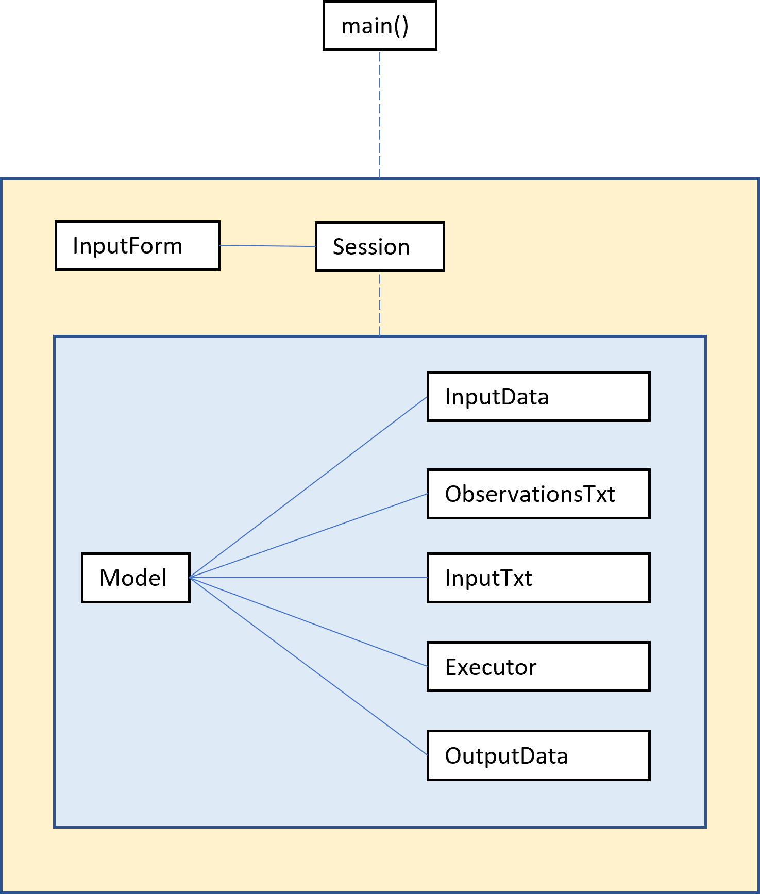

# GWLForecaster

#### Edit 20/08/2021
GWLForecaster.exe cannot be uploaded to GitHub due to file size restrictions

What this README is:
- It is a general guide to GWLForecaster, the program that performs
groundwater level forecasting using AquiModAWS.

What this README is not:
-	It is not an AquiMod or AquiModAWS user guide.
-	It is not a full report into groundwater level forecasting and therefore
does not cover modelling assumptions, source data validity or analysis of
outputs.

## 1. Introduction
AquiMod is a lumped, conceptual hydrological model, producing groundwater level
(GWL) as an output timeseries. The model is driven by precipitation and PET
data inputs. AquiModAWS is a modified version of the publicly available AquiMod
model produced by the British Geological Survey (BGS) for use at Anglian Water
Services (AWS). The BGS has calibrated a selection of AquiModAWS models at
observation boreholes across the AWS region for use by AWS. Every month, AWS
receives a three-month forecast for RAIN and PET data. By using this data as
input into a calibrated AquiModAWS model, a GWL forecast can be produced for
the next three months.

The purpose of the GWLForecaster program is to perform GWL modelling using
AquiModAWS. This may prompt the question, “Why can’t AquiModAWS be used on its
own to perform GWL forecasting?” Indeed, AquiModAWS is designed to be used
directly without any third-party program. However, AquiModAWS must be run from
the command line and is configured using text files. Furthermore, the output
files require processing into a tidy format. This is not a user-friendly
interface and makes performing multiple simulations a labour-intensive process.
GWLForecaster solves these problems by doing the following:
1.	Read timeseries and model configuration data from a user-friendly input
spreadsheet.
2.	Process input data and produce the Observations.txt and Input.txt files
required to run AquiModAWS.
3.	Execute AquiModAWS.
4.	Process the numerous AquiModAWS output files and produce a single, tidy
output file.

## 2. Installation
There is a user version and a developer version of GWLForecaster. The user
version features no code repositories and is run via a single executable file.
The developer version contains all code repositories, is run via a main.py file,
and contains no executable GWLForecaster file.

The advantage of the user version (and vice-versa for the developer version) is
that it contains fewer files and folders, and importantly, does not require a
python interpreter or any dependencies to run. The disadvantage of the user
version is that the source code cannot be viewed or modified, the executable
file is relatively large, and the executable file takes longer to run than the
main.py script.

### 2.1. User Version
Installing the user version of GWLForecaster is as simple downloading the
GWLForecaster_user folder (size: ~380 MB). From here, it is ready to run.

### 2.2. Developer Version
To install the developer version, download GWLForecaster_dev folder
(size: ~15 MB). The external dependencies required to run the program include:
-	A python interpreter
-	os module (built-in)
-	dataclasses module (built-in)
-	pandas

Built-in libraries come packaged with python. Pandas does not come automatically
with python; however, it is a standard package within the Anaconda distribution.
If Anaconda is not installed, Pandas can be installed by running `pip install
pandas` in the command line.

## 3. Usage
### 3.1. TL;DR - ([Definition](https://www.merriam-webster.com/dictionary/TL%3BDR))
1.	In Input_form.xlsx go to the Summary tab.
2.	In the ID column, give your simulation a name.
3.	In the Catchment column, enter the catchment to be modelled.
4.	In the Spinup Init GWL column enter any arbitrary positive number less
than 9999.
5.	In the Forecast Init GWL column enter the measured groundwater level at the
first day of the forecast.
6.	In the Number of Runs column specify the number of runs to be done per
simulation.
7.	Duplicate the Template tab and rename the tab to the ID specified in the
Summary tab.
8.	Enter the spinup and forecast data in the appropriate RAIN and PET columns.
9.	Save Input_Form.xlsx.
10.	Run GWLForecaster.exe or the main.py file.
11.	Access output CSV files in the “outputs” folder.

### 3.2. The Detail
The user interface of GWLForecaster is the Input_Form.xlsx spreadsheet, where
the model can be configured, timeseries data entered and batch simulations
queued. This spreadsheet contains a Summary tab, a Template tab and then as
many tabs as there are simulations to be performed, as specified by the user.

In the Summary tab of Input_Form.xlsx a user will find a table with a row for
each simulation that GWLForecaster will be instructed to perform. Every
simulation must have a unique ID in the ID column. The ID does not affect the
model itself but is important as output files for each simulation are named
after the ID. The Catchment column must contain the name of the groundwater
catchment to be simulated. The names of the available catchments can be checked
in the “models” folder. Note that the program is case sensitive and catchment
names must exactly match the folder names within “models”.

The Spinup Init GWL and Forecast Init GWL columns set the initial GWLs. Each
simulation period is split up into a spinup and a forecast period. The spinup
period is required for internal reservoirs to fill up within the AquiModAWS
model and equilibrate with the system. The spinup period precedes the forecast
period and is not included in the forecast. An initial GWL is required to start
the simulation at the spinup period. As this period is not included in the
forecast, any number entered here is arbitrary. Another initial GWL is required
at the start of the forecast period, resetting the GWL to a known level from
which the forecast will be based on. It is important that the Forecast Init GWL
is therefore based on a known value. Note that all GWLs are measured in metres
above ordnance datum.

The final column, Number of Runs, determines the number of iterations each
simulation will complete. Each iteration is run with a different parameter set,
therefore producing a set of outputs in a stochastic manner. Parameter sets were
selected during the model calibration process performed by the BGS. There are
between 500 and 10,000 parameter sets available for each catchment, and
therefore the maximum number of runs depends on the catchment. Bear in mind
that as the number of runs increase, more poorly performing parameter sets are
selected. There is thus a trade-off between a larger output sample set (from
which more statistically robust metrics can be calculated) and model
performance.

For each row in the Summary table, a user must create a separate simulation
tab. This can be copied from the Template tab. The name of each new tab should
match the IDs as provided in the Summary table. Within each simulation tab,
there are six columns to fill with input data, three for the spinup period and
three for the forecast period. Enter the appropriate timeseries here for RAIN
and PET data. Spinup and forecast columns are separated because these data will
most likely come from different sources, so sparing the user the task of
merging both datasets.

It is recommended that there be at least six months of spinup data preceding
the start of the forecast period, however AquiModAWS will take a spinup period
as short as one day. Note that both timeseries must use a daily timestep and
they must be continuous. This means there must be no missing days in the
timeseries, including between the end of the spinup period and the start of the
forecast period. That is to say, the final timestep of the spinup period must
be no earlier than the day before the start of the forecast period. If there is
overlap between the end of the spinup period and start of the forecast period,
the program will ignore the trailing spinup data and use only the forecast
data.

Once all simulations are configured and timeseries data entered, save the
Input_Form.xlsx, run the program. In the user version, this can be done by
double-clicking GWLForecaster.exe. In the developer version, this can be done
by running the main.py file, either from the command line (by setting the
current working directory to GWLForecaster_developer and executing the code
`python main.py`) or through an IDE.

The output files of GWLForecaster are saved as CSV files in the “outputs”
folder. Each file can be recognised by the ID that was used to uniquely
identify each simulation in the Summary tab of User_Input.xlsx. The raw
AquiModAWS output files can also accessible via
“models>{catchment name}>Output” folder. There is a file for each component of
the AquiModAWS model, of which there are three, and a file for each iteration
of each model, as designated by the Number of Runs column in the input form.
Bear in mind that if multiple simulations are being done on the same catchment
(i.e., there are multiple rows in the Summary tab of the input form specifying
the same catchment) only the outputs of the final simulation will be saved.

Finally, if, for any reason, a user would like to stop the program after it has
started running, press CTRL+C.

## 4. Development
The first point of note in the development of GWLForecaster is that this is my
first (relatively) large software development project. Although I attempted to
follow pythonic, SOLID, coding principles I recognise this code is probably
quite [smelly](https://en.wikipedia.org/wiki/Code_smell) and far from optimal.
At least it works.

### 4.1. Program Structure
GWLForecaster is built across two packages, the Session package (saved as
“session_resources”) and nested within that, the Model package (saved as
“model_resources”). The thought process behind this is that a single session
takes place each time GWLForecaster is run, and within a session, multiple
models (simulations) are run, so the Session package needs to be able to
leverage the Model package with it. The Session package therefore becomes the
wrapper, within which the Model package code is implemented. The main.py file
in the root directory therefore only interfaces with Session resources.

Figure 1. shows a pseudo-UML of the general structure of the program. The light
blue box indicates the Model package and the light yellow box indicates the
Session package. Each box represents a class, except for main() which
represents the main function. Solid lines indicate where there is a direct
relationship between classes in the class definition, i.e., there is a
dependency injection of one class to another. The dashed lines indicate a
relationship where a class is implemented, i.e., a class is instantiated and
methods are called. A 1:1 relationship is assumed for all connections.

#### 4.1.1. Session Package
The Session package consists of two modules, input_form and session. Input_form
contains the class InputForm, which reads in the Summary tab of the input form
and checks that all IDs are unique. Session contains the class Session, which
is instantiated with InputForm as an argument. Session then instantiates Model
objects within its initalise_models method. Session finally implements all the
input processing, execution and output processing required for each simulation
in the execute method. This is done linearly, with each simulation being
completed before then next is started. This is to prevent AquiModAWS
overwriting output files before they are processed, which can happen if a
catchment is being simulated more than once.

#### 4.1.2. Model Package
The Model package does most of the heavy lifting in GWLForecaster. It contains
six class modules as well as extra modules for user-defined functions and
exceptions that may come in handy. The class Model is instantiated first in the
class Session. Model acts as a data class without any methods. It carries all
the data required by the dependent classes to perform the simulation.
Therefore, all other classes are instantiated using the Model class.

The input_data module contains the InputData class. This class reads in the
input timeseries data from the individual simulation tabs in the Input Form
spreadsheet. It then parses out the spinup and forecast data from this sheet
and saves these data as pandas dataframes directly back to the Model object.
There is therefore two-way dependency between Model and InputData. Admittedly
there is a lot of repetition in this class. An improvement suggestion may be to
separate the class into a spinup class and a forecast class that inherit from
an input data base class, therefore complying with the single responsibility
principle.

The observations_txt module contains the ObservationsTxt class. This takes the
data stored in Model, processes it, and that to a configured Observations.txt
file required by AquiModAWS. Additionally, it calculates the length of the
spinup period and saves that back to Model as an attribute for use by other
classes. There is therefore two-way dependency here again.

Similar to observations_txt, input_txt contains the InputTxt class which is
responsible for processing data and outputting an Input.txt file, required by
AquiModAWS. InputTxt does not save any data back to the Model object and
therefore the dependency is just one-way. It is also important to bear in mind
that InputTxt does not write a new Input.txt file, only edits the current one
in place. Furthermore, InputTxt only edits the Number of runs and Spin-up
period variables, whilst expecting the other to be already appropriately
configured. Therefore the Input.txt file should always remain in its location
and should not be edited manually unless you know what you are doing.

The executor module contains the class Executor. After instantiation with the
Model object, this class has two methods. The first is to delete all files in
the output directory of the appropriate AquiModAWS catchment. This is because
any new runs of AquiModAWS will simply overwrite the existing files. This can
be a problem when previously a greater number of runs was selected. In this
case, only the newer files will be overwritten, and the older files will
remain, leading to the output processing code reading data from independent
simulations, which is not desirable. To avoid this, the output directory will
be cleared of all files. The second method simply executes AuiModAWS. It does
so via accessing the command line through the os package. AquiModAWS is
accessed then either through the system PATH variable or if AquiModAWS.exe is
present in the root directory. In case there are permissions issues with
accessing the PATH variable, it is recommended that AquiModAWS.exe always be
present in the root directory. Finally, Executor does not save and information
back to Model so the coupling here is one-directional.

The final module is output_data, containing the OutputData class. This class
loads the numerous AquiModAWS output files and processes them into a single 
CSV featuring all the iterated timeseries. The output file is named after the
ID of the simulation. The output data is indexed with the simulation ID, the
period type (spinup or forecast) and the timestep in date format.

### 4.3. Performance
The performance of the program depends on whether the user or developer version
is being run. The developer version is quicker (20 – 30 seconds quicker
perhaps) than the user version. Of course, this also depends highly on the
machine in question.

The majority of run time (> 50%) is spent in AquiModAWS itself, and therefore
cannot be optimised any further as this is a fully compiled executable. In
terms of the GWLForecaster code, most of the run time is spent reading the
input Excel spreadsheet and reading in up to hundreds or thousands of CSV files
produced by AquiModAWS. Pandas read_excel and read_csv functions are used here.
I do not know of any alternatives that could provide a real performance boost.

### 4.4.	What-Ifs and Exceptions
-	What if there is a mismatch between the IDs in the Input Form summary tab
and the simulation tabs?
    -   If and ID is specified for which there is no tab, the program will
    throw a “Worksheet not found error”.
    -	If there are additional tabs, not specified in the ID column of the
    summary tab, these will be ignored.
-	What if there is no spinup period?
    -	The program will throw an error along the lines of “TypeError: Cannot
    convert Float64Index to dtype datetime64[ns]; integer values are required
    for conversion”.
    -	AquiModAWS requires at least one day of spinup data.
    -	Apologies that the error is not more specific.
-	What if a greater number of runs is specified than there are parameter sets
available?
    -	Depending on the catchment, this will happen when the number of runs is
    greater than 500, 1,000 or 10,000.
    -	The AquiModAWS and the program will still run, however there will be
    NaN or no-data timeseries in the output for the iterations where parameter
    sets had run out.
    -	Bear in mind that a greater number of runs generally leads to worse
    model efficiency because less-optimal parameter sets are being chosen.
-	What if the input timeseries of different simulations have different dates
and periods?
    -	As long as both spinup and forecast timeseries together are continuous,
    GWLForecaster can run any period range and duration (greater than or equal
    to one day) across simulations.
-	What if an incorrect catchment name is entered into the Catchment column in
the Summary tab of Input Form?
    -	The program will return a FileNotFoundError and indicate the
    non-existent catchment folder that the program is looking for.

### 4.5.	Potential Improvements
Write Input.txt from scratch?

## 5.	Links
See the documentation folder for further reading in AquiMod and AquiModAWS or
visit the [BGS website](https://www.bgs.ac.uk/technologies/software/aquimod/).

## 6.	Contribute
Email me, Brogan McCawley, at bmccawley@anglianwater.co.uk.
